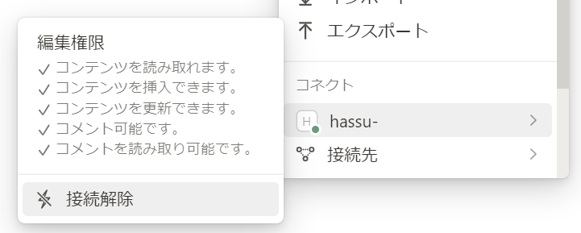

# Translate & Send to Notion

コピーした英文を翻訳し，結果をNotionのページに貼り付けるスクリプト

## インストール
1. リポジトリをクローン
```
$ git clone https://github.com/masahiro120/translation_to_notion.git
```

2. ライブラリをインストール
```
$ pip install -r requirements.txt
```

## 事前設定

1. `translation.py`に必要なAPIキーを設定
   - `DEEPL_API_KEY`に[DeepLのAPIキー](https://www.deepl.com/pro-api/?utm_term=deepl%20api&utm_campaign=JP%7CSearch%7CC%7CBrand-API%7CEnglish%7CExact&utm_source=adwords&utm_medium=ppc&hsa_acc=1083354268&hsa_cam=21005532228&hsa_grp=158625966453&hsa_ad=690485455825&hsa_src=g&hsa_tgt=kwd-900300572383&hsa_kw=deepl%20api&hsa_mt=e&hsa_net=adwords&hsa_ver=3&gad_source=1&gclid=CjwKCAjwwr6wBhBcEiwAfMEQs69dAe_gedSpkVswsp62qzmaeFiAdN220cySqSJNBqxLKdxak9TouBoCvzkQAvD_BwE "DeepLのAPIキー")を設定
   - `NOTION_API_KEY`に[NotionのAPIキー](https://www.notion.so/my-integrations "NotionのAPIキー")を設定

2. 翻訳を張り付けるNotionのページを設定   
   - `NOTION_PAGE_URL`に送信先のNotionページのURLを設定
      - NotionページにAPIキーをコネクト
      > 


## 使い方

- `shortcut.bat`または`shortcut_split.bat`を実行することで，スクリプトが起動
```
$ .\shortcut.bat
$ .\shortcut_split.bat
```
   - クリップボードの内容を翻訳し`NOTION_PAGE_URL`の左側に原文，右側に日本語訳を張り付ける
      - それぞれ文ごとに改行を行っている
   - 英文がページをまたぐなどで分かれている場合は`shortcut_split.bat`，分かれていない場合は`shortcut.bat`を実行
      - `shortcut_split.bat`実行時はスクリプト起動後分割先をコピーし，Spaceキーを入力後Enterキーを押すことで翻訳対象に追加可能
      - Spaceキーを入力せず，Enterキーを押すことで翻訳を実行


## ショートカットの利用
- `shortcut.bat`または`shortcut_split.bat`のショートカットをデスクトップに配置しプロパティからコマンドを設定することでコマンドから実行可能（Windowsのみ）
   > 

## 注意点
- Windows環境での使用を想定（コマンドプロンプト，PowerShell等）
- このスクリプトは，英文から日本語への翻訳を想定している
   - 他の言語に対応させる場合は，`translation.py`内の`source_lang`および`target_lang`を適宜変更
